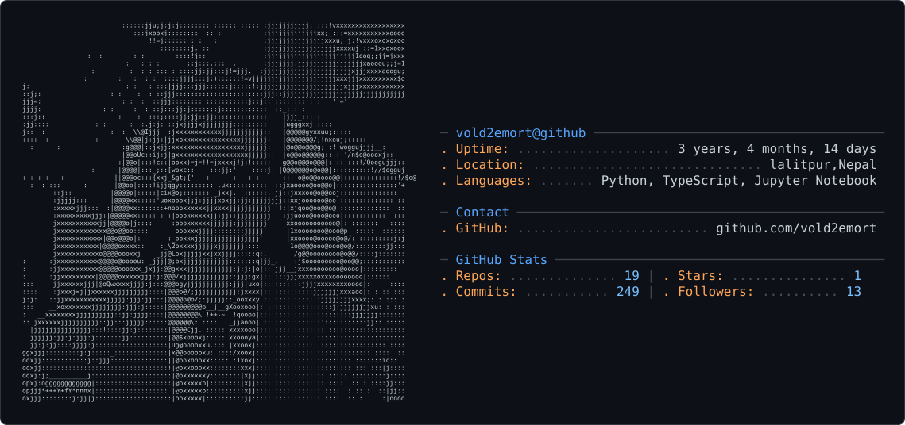

<h1 align="center">Hi 👋, I'm Pramish K.C</h1>
<h3 align="center">A passionate developer form Nepal.</h3>

- 🌱 I’m currently learning **python, Go, DJANGO, Backend Development, Full Stack Development**

- 💬 Ask me about **python, C, JavaScript, Django, React.js, Next.js, Docker**

- 📫 How to reach me **pramishkc066@gmail.com**

<picture>
  <source media="(prefers-color-scheme: dark)" srcset="dark_mode.svg" />
  <source media="(prefers-color-scheme: light)" srcset="light_mode.svg" />
  
</picture>

<!---
vold2emort/vold2emort is a ✨ special ✨ repository because its `README.md` (this file) appears on your GitHub profile.
You can click the Preview link to take a look at your changes.
--->
